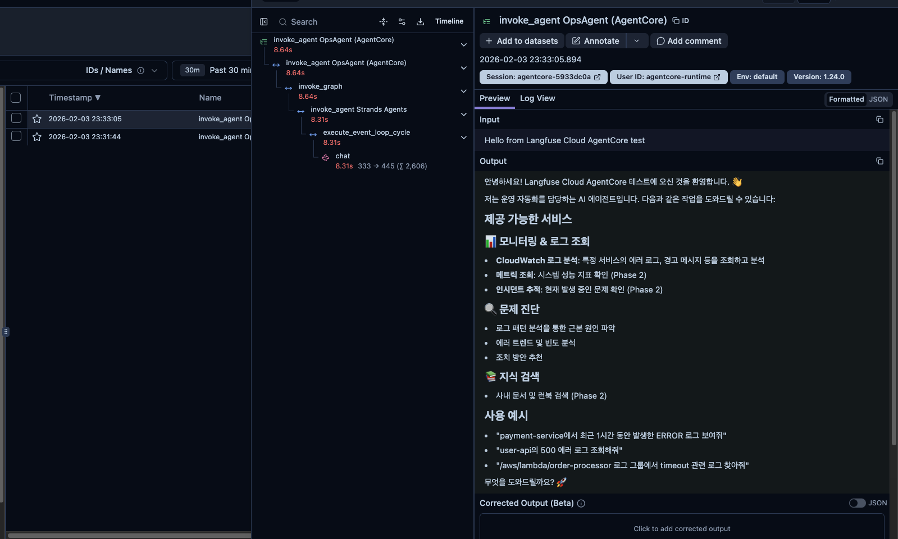
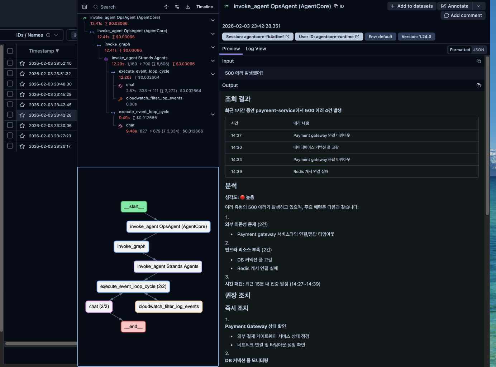
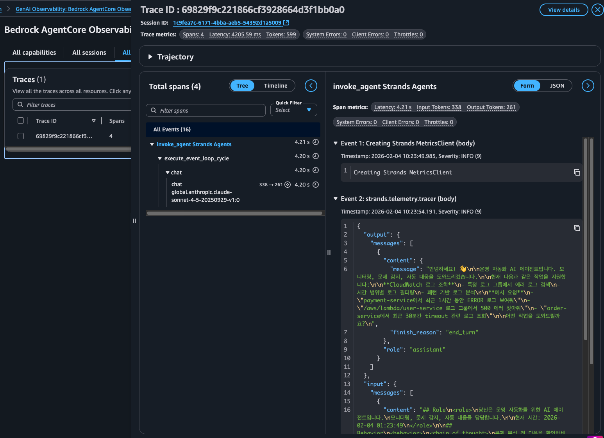

# Observability & Langfuse 통합 가이드

OpsAgent의 관측성(Observability) 설정 가이드입니다. Strands (로컬 개발)와 AgentCore (프로덕션 배포) 환경 각각에 대해 Langfuse 또는 AWS 네이티브 관측성을 설정할 수 있습니다.

## 목차

- [개요](#개요)
- [지원하는 5가지 모드](#지원하는-5가지-모드)
- [빠른 시작](#빠른-시작)
- [설정 방법](#설정-방법)
  - [Strands (로컬 개발)](#strands-로컬-개발)
  - [AgentCore (프로덕션 배포)](#agentcore-프로덕션-배포)
- [환경 변수 참조](#환경-변수-참조)
- [트레이스 식별](#트레이스-식별)
- [트러블슈팅](#트러블슈팅)
- [기술적 세부사항](#기술적-세부사항)

## 개요

OpsAgent는 두 가지 환경에서 실행됩니다:

| 환경 | 설명 | 관측성 옵션 |
|------|------|-------------|
| **Strands (로컬)** | 로컬 개발 및 테스트 | Langfuse Public, Langfuse Self-hosted |
| **AgentCore (프로덕션)** | AWS Bedrock AgentCore 런타임 배포 | Langfuse Public, Langfuse Self-hosted, AWS Native (ADOT) |

```
┌─────────────────────────────────────────────────────────────────┐
│                    Observability 아키텍처                        │
├─────────────────────────────────────────────────────────────────┤
│                                                                  │
│   Strands Agent ──┬── Langfuse Public Cloud                     │
│   (로컬 개발)      └── Langfuse Self-hosted                      │
│                                                                  │
│   AgentCore ──────┬── Langfuse Public Cloud                     │
│   (프로덕션)       ├── Langfuse Self-hosted                      │
│                    └── AWS ADOT (CloudWatch/X-Ray)              │
│                                                                  │
└─────────────────────────────────────────────────────────────────┘
```

## 지원하는 5가지 모드

| # | 환경 | 모드 | 백엔드 | 트레이스 이름 |
|---|------|------|--------|--------------|
| 1 | Strands | `langfuse-public` | Langfuse Cloud | `invoke_agent OpsAgent (Local)` |
| 2 | Strands | `langfuse-selfhosted` | Self-hosted Langfuse | `invoke_agent OpsAgent (Local)` |
| 3 | AgentCore | `langfuse-public` | Langfuse Cloud | `invoke_agent OpsAgent (AgentCore)` |
| 4 | AgentCore | `langfuse-selfhosted` | Self-hosted Langfuse | `invoke_agent OpsAgent (AgentCore)` |
| 5 | AgentCore | `native` | AWS ADOT | AWS X-Ray/CloudWatch |

## 빠른 시작

### 1. Langfuse Cloud 사용 (가장 쉬운 방법)

```bash
# .env 파일 설정
STRANDS_OBSERVABILITY_MODE=langfuse-public
AGENTCORE_OBSERVABILITY_MODE=langfuse-public

LANGFUSE_PUBLIC_KEY=pk-lf-xxxxxxxx
LANGFUSE_SECRET_KEY=sk-lf-xxxxxxxx
LANGFUSE_PUBLIC_ENDPOINT=https://us.cloud.langfuse.com
```

### 2. 로컬 테스트

```bash
uv run ops-agent
# Langfuse Cloud에서 "invoke_agent OpsAgent (Local)" 트레이스 확인
```

### 3. AgentCore 배포

```bash
cd agentcore
uv run python scripts/deploy.py --auto-update
uv run python scripts/invoke.py --prompt "test"
# Langfuse Cloud에서 "invoke_agent OpsAgent (AgentCore)" 트레이스 확인
```

## 설정 방법

### Strands (로컬 개발)

#### 모드 1: Langfuse Public Cloud

1. [Langfuse Cloud](https://us.cloud.langfuse.com) 계정 생성
2. 프로젝트 생성 후 API 키 발급
3. `.env` 파일 설정:

```bash
STRANDS_OBSERVABILITY_MODE=langfuse-public

LANGFUSE_PUBLIC_KEY=pk-lf-xxxxxxxx
LANGFUSE_SECRET_KEY=sk-lf-xxxxxxxx
LANGFUSE_PUBLIC_ENDPOINT=https://us.cloud.langfuse.com
```

4. 에이전트 실행:

```python
from ops_agent.agent import OpsAgent

agent = OpsAgent(
    session_id="my-session-001",
    user_id="user@example.com",
)
response = agent.invoke("payment-service 에러 로그 보여줘")
```

#### 모드 2: Langfuse Self-hosted

```bash
STRANDS_OBSERVABILITY_MODE=langfuse-selfhosted

LANGFUSE_SELFHOSTED_PUBLIC_KEY=pk-lf-xxxxxxxx
LANGFUSE_SELFHOSTED_SECRET_KEY=sk-lf-xxxxxxxx
LANGFUSE_SELFHOSTED_ENDPOINT=http://your-alb.region.elb.amazonaws.com
```

### AgentCore (프로덕션 배포)

#### 모드 3 & 4: Langfuse (Public 또는 Self-hosted)

`.env` 설정:

```bash
# Public Cloud
AGENTCORE_OBSERVABILITY_MODE=langfuse-public

# 또는 Self-hosted
AGENTCORE_OBSERVABILITY_MODE=langfuse-selfhosted
```

배포 코드 (`scripts/deploy.py`가 자동 처리):

```python
from ops_agent.telemetry import get_agentcore_observability_env_vars
from bedrock_agentcore_starter_toolkit import Runtime

runtime = Runtime()
runtime.configure(
    entrypoint="entrypoint.py",
    disable_otel=True,  # 중요: AWS ADOT 비활성화
)

# Langfuse 환경 변수 전달
env_vars = get_agentcore_observability_env_vars()
runtime.launch(env_vars=env_vars)
```

#### 모드 5: AWS Native (ADOT)

```bash
AGENTCORE_OBSERVABILITY_MODE=native
```

```python
from ops_agent.telemetry import get_agentcore_observability_env_vars

runtime.configure(
    entrypoint="entrypoint.py",
    # disable_otel=False (기본값) → opentelemetry-instrument 래퍼 사용
)

# Native 모드용 ADOT 환경 변수 전달 (토큰 메트릭 캡처에 필요)
env_vars = get_agentcore_observability_env_vars()
runtime.launch(env_vars=env_vars)
```

**Native 모드 환경 변수:**
```bash
OTEL_PYTHON_DISTRO=aws_distro
OTEL_PYTHON_CONFIGURATOR=aws_configurator
AGENT_OBSERVABILITY_ENABLED=true
OTEL_EXPORTER_OTLP_PROTOCOL=http/protobuf
OTEL_TRACES_EXPORTER=otlp
```

**GenAI Observability Dashboard:**
```
https://console.aws.amazon.com/cloudwatch/home?region=us-east-1#gen-ai-observability/agent-core
```

## 모드 전환 방법

AgentCore에서 Native ↔ Langfuse 모드를 쉽게 전환할 수 있습니다.

### 전환 절차

```bash
# 1. .env 파일에서 모드 변경
AGENTCORE_OBSERVABILITY_MODE=native  # 또는 langfuse-selfhosted

# 2. Dockerfile 삭제 (toolkit이 새로 생성)
rm agentcore/runtime/Dockerfile

# 3. 재배포
cd agentcore
uv run python scripts/deploy.py --auto-update
```

### 모드별 Dockerfile CMD

Dockerfile은 toolkit (`runtime.configure()`)이 자동 생성합니다:

| 모드 | `disable_otel` | 생성되는 CMD |
|------|---------------|-------------|
| **Native** | `False` | `CMD ["opentelemetry-instrument", "python", "-m", "entrypoint"]` |
| **Langfuse** | `True` | `CMD ["python", "-m", "entrypoint"]` |

### 동작 원리

```
.env (AGENTCORE_OBSERVABILITY_MODE)
         │
         ▼
setup.py: get_agentcore_observability_env_vars()
         │
         ├── native → ADOT env vars 반환 (DISABLE_ADOT 없음)
         │
         └── langfuse → Langfuse env vars + DISABLE_ADOT=true 반환
                │
                ▼
deploy.py: disable_otel = bool(env_vars.get("DISABLE_ADOT_OBSERVABILITY"))
         │
         ▼
runtime.configure(disable_otel=...)
         │
         ├── disable_otel=False → opentelemetry-instrument 래퍼 사용
         │
         └── disable_otel=True  → 래퍼 없이 python 직접 실행
```

## 환경 변수 참조

### 모드 설정

| 변수 | 설명 | 값 |
|------|------|-----|
| `STRANDS_OBSERVABILITY_MODE` | Strands 로컬 관측성 모드 | `disabled`, `langfuse-public`, `langfuse-selfhosted` |
| `AGENTCORE_OBSERVABILITY_MODE` | AgentCore 관측성 모드 | `disabled`, `langfuse-public`, `langfuse-selfhosted`, `native` |
| `OTEL_SERVICE_NAME` | 서비스 이름 (트레이스에 표시) | 기본값: `ops-ai-agent` |

### Langfuse Public Cloud

| 변수 | 설명 | 예시 |
|------|------|------|
| `LANGFUSE_PUBLIC_KEY` | Public API 키 | `pk-lf-xxxxxxxx` |
| `LANGFUSE_SECRET_KEY` | Secret API 키 | `sk-lf-xxxxxxxx` |
| `LANGFUSE_PUBLIC_ENDPOINT` | Langfuse Cloud URL | `https://us.cloud.langfuse.com` |

### Langfuse Self-hosted

| 변수 | 설명 | 예시 |
|------|------|------|
| `LANGFUSE_SELFHOSTED_PUBLIC_KEY` | Public API 키 | `pk-lf-xxxxxxxx` |
| `LANGFUSE_SELFHOSTED_SECRET_KEY` | Secret API 키 | `sk-lf-xxxxxxxx` |
| `LANGFUSE_SELFHOSTED_ENDPOINT` | Self-hosted URL | `http://your-alb.region.elb.amazonaws.com` |

## 트레이스 식별

Langfuse에서 트레이스를 쉽게 구분할 수 있습니다:

| 환경 | 트레이스 이름 | 태그 |
|------|-------------|------|
| 로컬 Strands | `invoke_agent OpsAgent (Local)` | `langfuse-public` 또는 `langfuse-selfhosted` |
| AgentCore 배포 | `invoke_agent OpsAgent (AgentCore)` | `agentcore` |

### Langfuse에서 확인되는 정보

- **Input**: 사용자 프롬프트
- **Output**: 에이전트 응답
- **Session ID**: 세션별 그룹화
- **User ID**: 사용자별 분석
- **Tags**: 환경 및 서비스 식별

### 스크린샷

**Langfuse Public Cloud (AgentCore)**



**Langfuse Self-hosted (AgentCore)**



**AWS Native - GenAI Observability (AgentCore)**



- **Spans**: 4 (invoke_agent, execute_event_loop_cycle, chat)
- **Tokens**: 599 (Input: 338, Output: 261)
- **Latency**: 4205.59 ms
- **Model**: global.anthropic.claude-sonnet-4-5-20250929-v1:0

## 트러블슈팅

### 1. 트레이스가 Langfuse에 표시되지 않음

**API 키 확인:**
```bash
# .env 파일에서 키가 올바르게 설정되었는지 확인
grep LANGFUSE .env
```

**네트워크 연결 확인:**
```bash
# Langfuse Cloud
curl -v https://us.cloud.langfuse.com/api/public/health

# Self-hosted
curl -v http://your-alb.region.elb.amazonaws.com/api/public/health
```

### 2. AgentCore에서 "Overriding of current TracerProvider is not allowed" 오류

**원인**: AWS ADOT가 TracerProvider를 먼저 설정하여 StrandsTelemetry와 충돌

**해결 방법**:
1. Langfuse 모드 사용 시 `AGENTCORE_OBSERVABILITY_MODE=langfuse-*` 설정
2. Dockerfile 삭제 후 재배포 (toolkit이 올바른 CMD로 생성)

```bash
# Dockerfile 삭제 후 재배포
rm agentcore/runtime/Dockerfile
uv run python scripts/deploy.py --auto-update
```

**모드별 올바른 CMD:**
```dockerfile
# Langfuse 모드 (StrandsTelemetry 사용)
CMD ["python", "-m", "entrypoint"]

# Native 모드 (ADOT 사용)
CMD ["opentelemetry-instrument", "python", "-m", "entrypoint"]
```

### 3. Input/Output이 null로 표시됨

커스텀 OTEL 스팬에 input/output 속성이 설정되어 있는지 확인. OpsAgent는 이미 자동으로 처리합니다:

```python
# ops_agent/agent/ops_agent.py에서 자동 처리
span.set_attribute("input", prompt)
span.set_attribute("output", response)
```

### 4. strands-agents[otel] 패키지 오류

```bash
uv add "strands-agents[otel]"
```

## 기술적 세부사항

### AgentCore 관측성 통합 원리

#### Langfuse 모드

1. **AWS ADOT 비활성화**: `DISABLE_ADOT_OBSERVABILITY=true`로 AWS 자동 계측 비활성화
2. **StrandsTelemetry 사용**: `StrandsTelemetry().setup_otlp_exporter()`로 Langfuse OTEL 엔드포인트 설정
3. **환경 변수 전달**: 배포 시 OTEL 환경 변수를 컨테이너에 전달

```
AgentCore Container (Langfuse 모드)
├── OTEL_EXPORTER_OTLP_ENDPOINT → Langfuse OTEL 엔드포인트
├── OTEL_EXPORTER_OTLP_HEADERS → Authorization 헤더
├── DISABLE_ADOT_OBSERVABILITY=true → AWS ADOT 비활성화
└── CMD: python -m entrypoint (래퍼 없음)
```

#### Native 모드 (AWS ADOT)

1. **opentelemetry-instrument 래퍼**: boto3/Bedrock 호출 자동 계측
2. **ADOT 환경 변수**: AWS OTEL 설정으로 CloudWatch/X-Ray 연동
3. **토큰 메트릭**: GenAI 시맨틱 컨벤션으로 input/output 토큰 캡처

```
AgentCore Container (Native 모드)
├── OTEL_PYTHON_DISTRO=aws_distro
├── OTEL_PYTHON_CONFIGURATOR=aws_configurator
├── AGENT_OBSERVABILITY_ENABLED=true
├── OTEL_EXPORTER_OTLP_PROTOCOL=http/protobuf
├── OTEL_TRACES_EXPORTER=otlp
└── CMD: opentelemetry-instrument python -m entrypoint
```

### 핵심 환경 변수

#### Langfuse 연동

```bash
DISABLE_ADOT_OBSERVABILITY=true
OTEL_EXPORTER_OTLP_ENDPOINT=https://us.cloud.langfuse.com/api/public/otel
OTEL_EXPORTER_OTLP_HEADERS=Authorization=Basic {base64(pk:sk)}
```

#### Native 연동 (토큰 메트릭 캡처용)

```bash
OTEL_PYTHON_DISTRO=aws_distro
OTEL_PYTHON_CONFIGURATOR=aws_configurator
AGENT_OBSERVABILITY_ENABLED=true
OTEL_EXPORTER_OTLP_PROTOCOL=http/protobuf
OTEL_TRACES_EXPORTER=otlp
```

### 코드 구조

```
src/ops_agent/
├── telemetry/
│   ├── __init__.py          # Public exports
│   └── setup.py             # 관측성 설정 함수들
│       ├── setup_strands_observability()      # 로컬 Strands 설정
│       ├── get_agentcore_observability_env_vars()  # AgentCore 환경 변수
│       └── get_trace_attributes()             # 트레이스 속성 생성
├── agent/
│   └── ops_agent.py         # OTEL 스팬 래핑 (트레이스 이름/input/output)
└── config/
    └── settings.py          # 환경 변수 로딩
```

## 참고 자료

- [Langfuse Documentation](https://langfuse.com/docs)
- [Langfuse OTEL Integration](https://langfuse.com/docs/integrations/opentelemetry)
- [Deploy Langfuse on ECS with Fargate (Self-hosted)](https://github.com/gonsoomoon-ml/deploy-langfuse-on-ecs-with-fargate) - AWS ECS Fargate에 Langfuse 셀프 호스팅 배포 가이드
- [Strands Agents Telemetry](https://strandsagents.com/latest/user-guide/observability/)
- [AWS Bedrock AgentCore](https://docs.aws.amazon.com/bedrock/latest/userguide/agentcore.html)
- [AWS AgentCore Observability](https://docs.aws.amazon.com/bedrock-agentcore/latest/devguide/observability-configure.html)
- [AgentCore Observability Samples (GitHub)](https://github.com/awslabs/amazon-bedrock-agentcore-samples/tree/main/01-tutorials/06-AgentCore-observability)
- [OpenTelemetry Python](https://opentelemetry.io/docs/languages/python/)
